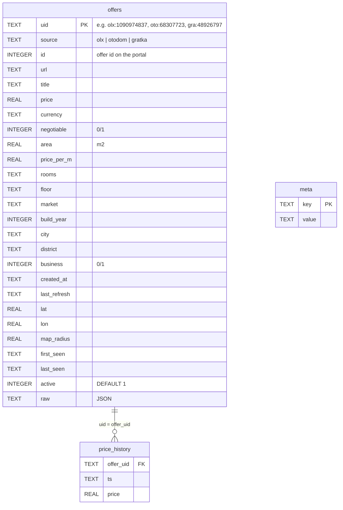

# Database schema

`monitor_ofert.py` stores everything in a single SQLite file — `oferty.db` by
default (override with `--db`). The schema is created in `init_schema()` and
upgraded in place by `migrate_db()` (`src/monitor_ofert.py`).

A sample database lives in `example_data/oferty.db.gz`.

## Overview

`meta` is a standalone key/value table with no relations. There are no
explicit indexes or foreign-key constraints — the relation between
`price_history` and `offers` is enforced only by the application.

## `offers`

One row per offer ever seen, across all portals. Rows are never deleted —
offers that disappear from the portal are only marked inactive.

| Column | Type | Description |
| --- | --- | --- |
| `uid` | TEXT, PK | Portal-scoped id: `olx:<id>`, `oto:<id>` or `gra:<id>`. |
| `source` | TEXT | Portal key: `olx`, `otodom` or `gratka`. |
| `id` | INTEGER | Offer id on the portal. |
| `url` | TEXT | Link to the offer page. |
| `title` | TEXT | Offer title (trimmed). |
| `price` | REAL | Current total price. |
| `currency` | TEXT | Currency code, defaults to `PLN`. |
| `negotiable` | INTEGER | `1` if the price is negotiable (OLX only; always `0` for Otodom and Gratka). |
| `area` | REAL | Area in m². |
| `price_per_m` | REAL | Price per m²; computed as `price / area` when the portal doesn't provide it. |
| `rooms` | TEXT | Human-readable label, e.g. `1 pokój`, `2 pokoje`. |
| `floor` | TEXT | Floor label as shown by the portal, e.g. `Parter`. |
| `market` | TEXT | `Pierwotny` (primary) / `Wtórny` (secondary) / `NULL`. |
| `build_year` | INTEGER | Year the building was built. Only Otodom and Gratka provide it (~94–95% of their listings); OLX doesn't collect it at all, so its rows are always `NULL`. For developments under construction it is the planned completion year, so values a few years ahead are normal. Values outside 1200–(current year + 15) are dropped as typos (`to_year`). |
| `city` | TEXT | City name. |
| `district` | TEXT | District name. |
| `business` | INTEGER | `1` if listed by an agency / developer, `0` for private sellers. |
| `created_at` | TEXT | When the offer was originally published on the portal (portal's timestamp, ISO 8601; format varies by source). |
| `last_refresh` | TEXT | Last time the offer was refreshed/bumped on the portal. |
| `lat`, `lon` | REAL | Coordinates. Once set, they are not overwritten with `NULL` on later scans. |
| `map_radius` | REAL | Location accuracy radius; `> 0` means the seller gave only an approximate location (OLX). Always `0` for Otodom and Gratka, which give an exact point. |
| `first_seen` | TEXT | Local timestamp of the scan that first found the offer. |
| `last_seen` | TEXT | Local timestamp of the most recent scan that found the offer. |
| `active` | INTEGER | `1` = present in the last full scan of its portal, `0` = withdrawn. Set back to `1` if the offer reappears. |
| `raw` | TEXT | Full source JSON of the offer. For Otodom it may include an `_ad` key, and for Gratka a `_detail` key, with details fetched from the offer page (description, photos, coordinates, market type, build year, …), carried over between scans. Gratka's `_detail.buildYear` is written on every fetch, `null` included — its presence is what tells details fetched by the query that asks for the build year apart from older ones, which have to be fetched again. |

`first_seen`, `last_seen` and `price_history.ts` are local time in
`YYYY-MM-DDTHH:MM:SS` format (no timezone).

## `price_history`

Append-only log of prices. A row is added when an offer is first seen (if it
has a price) and every time its price changes by at least 1 unit.

| Column | Type | Description |
| --- | --- | --- |
| `offer_uid` | TEXT | References `offers.uid`. |
| `ts` | TEXT | Local timestamp of the scan that recorded the price. |
| `price` | REAL | Price at that time. |

## `meta`

Key/value store for run state.

| Key | Value |
| --- | --- |
| `search_url` | JSON array of search URLs this database was built from. Used to prevent mixing different searches in one file. |
| `last_run` | Local timestamp of the last completed run. |
| `api_params::<search_url>` | JSON object with cached OLX API parameters (`category_id`, `region_id`, `city_id`, …) for that URL. |
| `api_params` | Legacy (single-URL) version of the above, read only as a fallback. |
| `fix:otodom_created_at` | `1` once the one-off Otodom `created_at` correction migration has run. |
| `fix:build_year` | `1` once `build_year` has been read out of the already stored `raw` JSON. |
| `fix:otodom_columns` | `1` once the one-off Otodom `floor` / `market` / `build_year` / `currency` restore migration has run. |

## Sync lifecycle

For every scan, `sync()` does the following per fetched offer:

1. **New `uid`** → insert into `offers` (`first_seen = last_seen = now`,
   `active = 1`) and add the initial price to `price_history`.
2. **Known `uid`** → update all fields, `last_seen = now`, `active = 1`;
   if the rounded price changed, append to `price_history`.

After that, for portals that were scanned in full (and not on the first run),
every active offer that was **not** fetched is set to `active = 0`.

## Migrations

`migrate_db()` runs on every start and handles databases created by older
versions:

- **Single-portal → multi-portal:** tables keyed by the numeric OLX `id`
  (`price_history.offer_id`) are rebuilt with `uid` / `source` /
  `offer_uid`.
- **Coordinates backfill:** fills missing `lat` / `lon` / `map_radius` for OLX
  offers from the stored `raw` JSON.
- **Build year:** adds the `build_year` column and fills it from the already
  stored `raw` JSON (Otodom `_ad.target.Build_year`, Gratka `_detail.buildYear`);
  guarded by the `fix:build_year` meta key. Gratka listings whose details were
  saved before the field existed have nothing to read there — those are
  re-fetched from the portal on the next full scan (see `GratkaSource.enrich`),
  not by this migration.
- **Otodom `created_at` fix:** recomputes `created_at` from `raw` (older
  versions stored the refresh date instead); guarded by the
  `fix:otodom_created_at` meta key.
- **Otodom floor / market / currency restore:** older versions parsed known
  Otodom offers without their stored `_ad` details on a plain list scan and
  overwrote `floor`, `market` and `build_year` with NULL, and always stored
  `currency` as `PLN` (some offers are priced in EUR). This re-parses the
  stored `raw`: `floor` / `market` / `build_year` are only filled in, never
  cleared, and `currency` is taken from `totalPrice.currency`; guarded by the
  `fix:otodom_columns` meta key. Since then `OtodomSource.enrich` puts the
  stored `_ad` back before parsing.

Separately, if the default `oferty.db` doesn't exist but the legacy
`olx_oferty.db` does, the file is renamed to `oferty.db` on startup.
